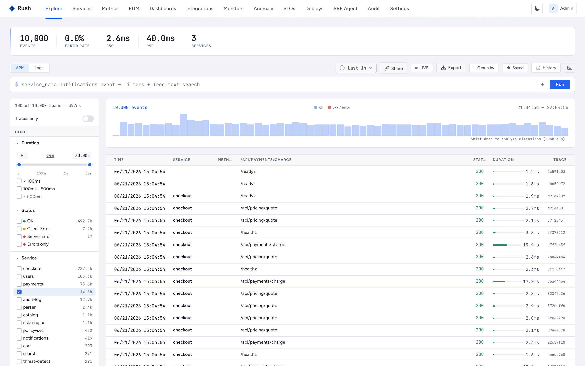

<div align="center">

# frontend

**The [Rush](https://github.com/RushObservability) web UI.**

[](https://github.com/RushObservability/frontend/actions/workflows/ci.yml)
[](https://github.com/RushObservability/frontend/actions/workflows/release.yml)


</div>

A single-page Vue 3 app: trace and log search, the metrics explorer, dashboards, alerts, SLOs, anomalies, RUM, and settings. It talks to [query-api](https://github.com/RushObservability/query-api) over HTTP for everything and opens an SSE stream to [sre-agent](https://github.com/RushObservability/sre-agent) for live investigations. No server-side rendering — in production nginx just serves the static build.

<div align="center">



<sub><em>Explore — search across all your telemetry (service names anonymized).</em></sub>

</div>

## Quick start

```bash
make install
make dev        # Vite dev server on :5173
```

Needs Node 22+ and query-api running on `:8080`; the dev server proxies `/api` and `/prom` to it. To run the production image instead:

```bash
make up         # nginx on :5180, proxying to query-api on the host
```

## What's in it

Explore (unified trace + log search with a query builder), Services and per-service detail with a dependency graph, a PromQL Metrics explorer, Dashboards, Alerts and notification channels, SLOs with burn-rate, Anomaly rules, RUM (per-app vitals, pages, errors, sessions), Stats, and Settings (tenants, users, SSO, API keys, retention, the metric firewall). Routes live in `src/router.ts`; views in `src/views`.

## Stack

Vue 3 with `<script setup>`, TypeScript, Vite, `vue-tsc` for type-checking, nginx for production. The app instruments itself with the `@wide/rum` SDK, so the UI shows up in its own RUM data.

```bash
make build      # type-check + production build
make test       # unit tests (vitest)
make typecheck
```

Every pull request runs [CI](.github/workflows/ci.yml): it installs deps, runs the unit tests, and builds the app.

## Part of Rush

- [query-api](https://github.com/RushObservability/query-api) — the backend this reads from
- [sre-agent](https://github.com/RushObservability/sre-agent) — streams investigations into the UI
- [helm-charts](https://github.com/RushObservability/helm-charts) — deploys the whole stack

## License

[Business Source License 1.1](LICENSE).
