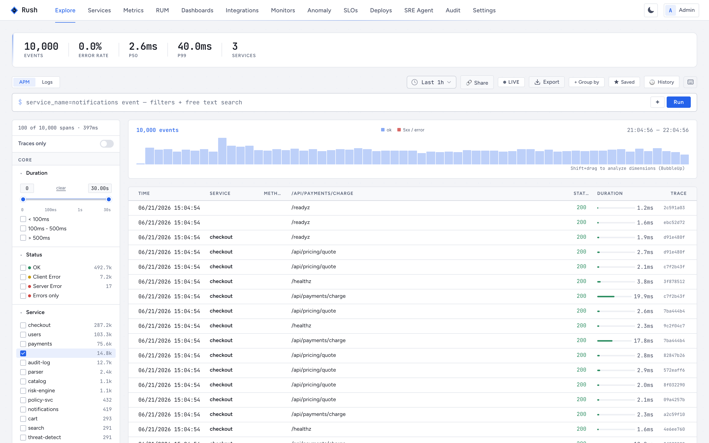

<div align="center">

# frontend

**The [Rush](https://github.com/RushObservability) web UI.**

[](https://github.com/RushObservability/frontend/actions/workflows/ci.yml)
[](https://github.com/RushObservability/frontend/actions/workflows/release.yml)


</div>

A single-page Vue 3 app: trace and log search, the metrics explorer, dashboards, alerts, SLOs, anomalies, RUM, and settings. It talks to [query-api](https://github.com/RushObservability/query-api) over HTTP for everything and opens an SSE stream to [sre-agent](https://github.com/RushObservability/sre-agent) for live investigations. No server-side rendering — in production nginx just serves the static build.

<div align="center">



<sub><em>Explore — search across all your telemetry (service names anonymized).</em></sub>

</div>

## Quick start

```bash
make install
make dev        # Vite dev server on :5173
```

Needs Node 22+ and query-api running on `:8080`; the dev server proxies `/api` and `/prom` to it. To run the production image instead:

```bash
make up         # nginx on :5180, proxying to query-api on the host
```

To validate the metrics used by the capacity view, run this while query-api and
sre-agent expose their `/metrics` endpoints:

```bash
make validate-capacity-metrics
```

The check defaults to `http://localhost:8080/metrics` and
`http://localhost:8081/metrics`. Override either endpoint with
`QUERY_API_METRICS_URL` or `SRE_AGENT_METRICS_URL`. It verifies required metric
families, Prometheus types, exact low-cardinality labels, and rejects tenant or
request identity labels.

## What's in it

Explore (unified trace + log search with a query builder), Services and per-service detail with a dependency graph, a PromQL Metrics explorer, Dashboards, Alerts and notification channels, SLOs with burn-rate, Anomaly rules, RUM (per-app vitals, pages, errors, sessions), and Settings (tenants, users, SSO, API keys, retention, the metric firewall, and the AI Agent). AI Agent settings include tenant access, model/reasoning policy, investigation limits, and custom Markdown skills. Routes live in `src/router.ts`; views in `src/views`.

## Saved log views

In **Settings → Log views**, choose a tenant using the selector above the table.
New and Edit open a right-side drawer. Choose a visibility for new views:

- **Shared with tenant**: everyone with access to that tenant can use the view.
  Only admins can create, edit, or delete shared views. Existing views remain shared.
- **Only me**: any signed-in user, including viewers, can manage their own views.
  Personal views belong to both the selected tenant and that user. They do not
  appear for other users, including admins browsing their own views.

Non-admin users can open **Explore → Logs → Manage views**, or go directly to
`/settings/log-views`. This does not grant access to other admin settings.
**Copy to my views** creates a personal copy of a shared view. Editing an existing
view does not change its visibility. Each scope allows up to 50 views per tenant.

Choose **Use flight example** to start with `type=event_data` as the base filter
and **Time | Airline | Flight number | Status** as the columns.

In **Explore → Logs**, select from **Shared with tenant** or **My views**.
Personal-view links work only for their owner in the matching tenant. A missing
view never falls back to an unfiltered search. Its base filters apply automatically;
the search bar stays empty until you add a search, such as `status=delayed`.
The search and base filters must both match. Selecting **All logs** removes the
view's base filters and restores the standard log columns.

Column fields can be builtins (`timestamp`, `service_name`, `severity_text`,
`body`), log attributes (`log.airline`), resource attributes
(`resource.k8s.namespace.name`), or scalar JSON fields (`body.flight.number`).
An unprefixed attribute checks log attributes first, then resource attributes.
Use `body.type` for the base filter if `type` lives inside a JSON message.
Missing values appear as a dash; clicking a row still opens the full log.

The search bar suggests fields from the view and loaded logs. Type `airline=`
or `body.airline=` to see matching values, then click a suggestion or press Tab.
Values with spaces are quoted automatically, for example `airline="Example Air"`.
Value suggestions use the current tenant, time range, and view's base filters.

**Columns** in Explore lets you change headings, order, and visible fields for
the current page. Those overrides are included in shared URLs and do not change
the saved view. Edit a shared view in Settings to update it for everyone in the
tenant, or edit a personal view to update only your copy. Views are conveniences
for browsing, not access-control rules; users
can still choose All logs. They are available in both frontend editions and
require a query-api build with `/api/v1/settings/log-views` support.

## Stack

Vue 3 with `<script setup>`, TypeScript, Vite, `vue-tsc` for type-checking, nginx for production. The app instruments itself with the `@wide/rum` SDK, so the UI shows up in its own RUM data.

```bash
make build      # type-check + production build
make test       # unit tests (vitest)
make typecheck
```

Every pull request runs [CI](.github/workflows/ci.yml): it installs deps, runs the unit tests, and builds the app.

## Frontend editions

Database and Kubernetes product integrations are composed into a separate licensed build. The public repository owns the shared UI and a small build-time extension contract. See [Frontend editions](docs/editions.md) for the boundary and verification command.

## Part of Rush

- [query-api](https://github.com/RushObservability/query-api) — the backend this reads from
- [sre-agent](https://github.com/RushObservability/sre-agent) — streams investigations into the UI
- [helm-charts](https://github.com/RushObservability/helm-charts) — deploys the whole stack

## License

[Business Source License 1.1](LICENSE).
